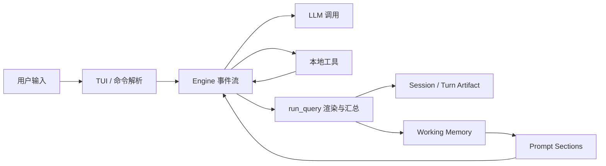
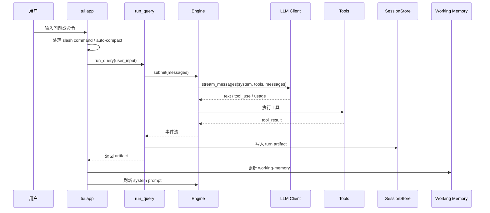
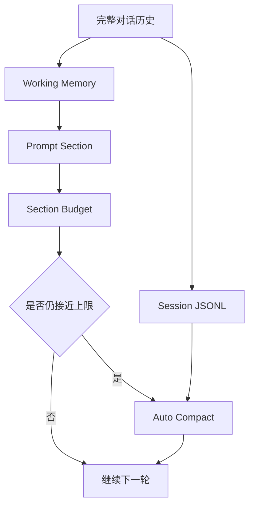
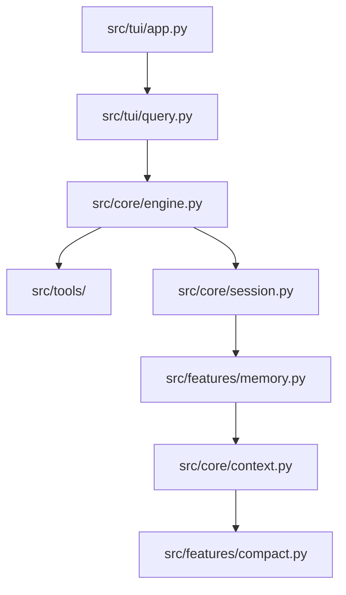

# LongCode

LongCode 是一个面向长链路代码开发任务的 AI Coding 助手。它基于 `cc-mini` 二次开发，重点增强了会话延续、执行过程观察、上下文治理和多阶段开发支持。

> 本项目主要用于学习和工程实验，适合研究 AI Coding 助手的主链路、工具调用、会话系统、记忆系统和上下文压缩策略。

## 项目定位

LongCode 不是只做单轮问答的命令行聊天工具，而是一个带有工具、会话、记忆和上下文预算的本地 Coding Agent。它的目标是让长任务能被持续推进，并且让每一轮执行都能被复盘。



## 核心能力

| 能力 | 说明 | 代表模块 |
| --- | --- | --- |
| 交互式 TUI | 支持流式输出、斜杠命令、终端模式、会话恢复 | `src/tui/app.py` |
| 工具调用 | 支持读文件、搜索、编辑、写文件、Bash、Agent 等工具 | `src/tools/` |
| 会话系统 | 将多轮对话保存为 JSONL，并支持 `/history`、`/resume` | `src/core/session.py` |
| 单轮证据链 | 每一轮生成 turn artifact，记录输入、输出、工具、usage 和错误 | `src/tui/query.py` |
| Prompt 分层 | 将 system prompt 拆成稳定段和动态段，输出 section metadata | `src/core/context.py` |
| Working Memory | 为当前 session 保存短期任务状态，随 `/resume` 恢复 | `src/features/memory.py` |
| 自动 Compact | 接近上下文上限时压缩历史消息，并显示提醒 | `src/features/compact.py` |
| Section 预算 | compact 前先缩减低优先级 section，让 compact 成为最后手段 | `src/core/context.py` |
| Coordinator / Agent | 支持后台 worker、Explore agent 和任务通知 | `src/features/agents/` |
| Sandbox | 支持 Bash 沙箱配置和权限控制 | `src/features/sandbox/` |
| Skills | 支持内置技能和项目 / 用户技能发现 | `src/features/skills.py` |
| Buddy | 带有桌宠反馈、心情和小游戏扩展 | `src/buddy/` |

## 主链路

一次用户输入会沿着以下路径执行：



这条链路最值得先学，因为它串起了项目的大部分核心概念：输入解析、模型调用、工具执行、事件渲染、会话保存、短期记忆和上下文治理。

## 上下文治理

LongCode 的上下文治理分三层。



1. **Session JSONL** 保存完整会话，方便恢复和审计。
2. **Working Memory** 保存当前任务的短期摘要，避免每轮都重新依赖完整历史。
3. **Section Budget** 在 compact 前优先缩减低优先级动态 section，减少不必要的整体压缩。

## 关键术语

### working-memory

`working-memory` 是 session 级短期工作记忆。它不是长期记忆，也不是完整聊天历史。

它主要保存：

- 最近用户问题和 assistant 回答摘要
- 当前任务的短期推进状态
- worker notification 等需要延续到下一轮的信息
- auto-compact 等上下文事件摘要

对应文件通常是：

```text
<session-id>.working-memory.json
```

它的作用是让系统在多轮开发中保留“当前正在做什么”，减少重复解释和重复读取。

### section

`section` 是 system prompt 的一个结构化片段。以前 prompt 是一整段字符串，现在被拆成多个有名字的区块。

常见 section 包括：

| Section | 类型 | 说明 |
| --- | --- | --- |
| `intro` | 稳定 | Agent 身份和安全边界 |
| `system` | 稳定 | 通用系统规则 |
| `doing_tasks` | 稳定 | 软件工程任务规则 |
| `using_tools` | 稳定 | 工具使用规则 |
| `environment` | 动态 | 当前目录、平台、模型等环境信息 |
| `git` | 动态 | 当前分支、状态和最近提交 |
| `claude_md` | 动态 | 项目级 `CLAUDE.md` 指令 |
| `memory_system` | 动态 | 长期 memory 系统说明和索引 |
| `working_memory` | 动态 | 当前 session 的短期工作记忆 |

### stable prefix

`stable prefix` 是 prompt 中开头连续稳定的 section。它通常不随目录、Git 状态或 memory 变化而变化。

这个结构为后续显式 prompt caching 提供基础。当前项目已经具备可缓存结构，但是否真正提升 API cache 命中率，还取决于 provider 调用层是否接入显式缓存参数。

### turn artifact

`turn artifact` 是单轮执行证据。它记录一轮请求中的关键数据：

- 输入预览
- assistant 输出预览
- 事件 timeline
- 工具调用摘要
- usage / cost
- 错误信息
- auto-compact 和 working-memory 相关 context

它解决的问题是：复杂工具回合结束后，不再只能从终端输出和完整 session 里倒推过程。

### compact

`compact` 是对旧消息做摘要压缩，用摘要替代早期上下文，从而释放 token 空间。

LongCode 现在会在自动 compact 前显示提醒，并记录压缩前后的 message 数和 token 估算值。

### section budget

`section budget` 是 section 级上下文预算。它会在整体 compact 前先处理动态 section。

当前优先缩减顺序是：

1. 删除 `companion_intro`
2. 删除 `git`
3. 删除 `memory_system`
4. 将 `working_memory` 收敛到 summary
5. 截短 `claude_md`

如果缩减后已经低于风险线，就不触发 compact；如果仍然接近上限，才进入整体 compact。

## 目录结构

```text
src/
  core/            # Engine、LLM、配置、权限、session、context
  tui/             # CLI / TUI 入口、输入、渲染、shell、query
  tools/           # Read、Edit、Write、Glob、Grep、Bash、Agent 等工具
  features/        # compact、memory、cost、plan、skills、sandbox、agents
  commands/        # slash command 解析与执行
  buddy/           # 桌宠、心情、小游戏扩展
tests/             # pytest 测试
assets/            # README 和展示图片
学习/              # 学习笔记和二次开发参考资料
```

## 安装与运行

### 环境要求

- Python `>=3.11`
- 可用的 Anthropic 或 OpenAI compatible API key
- Windows / macOS / Linux 终端环境

### 安装依赖

```bash
pip install -e .
pip install -e .[dev]
```

### 配置 API Key

可以使用环境变量：

```bash
export ANTHROPIC_API_KEY="your-api-key"
```

Windows PowerShell：

```powershell
$env:ANTHROPIC_API_KEY = "your-api-key"
```

也可以使用配置文件：

```toml
provider = "anthropic"
model = "claude-opus-4-6"
max_tokens = 32000
memory_dir = "~/.config/cc-mini/memory"

[providers.anthropic]
api_key = "your-api-key"
```

默认读取路径：

```text
~/.config/cc-mini/config.toml
.cc-mini.toml
```

### 启动

```bash
cc-mini
```

非交互模式：

```bash
cc-mini -p "解释这个项目的主链路"
```

指定模型：

```bash
cc-mini --model opus
cc-mini --model sonnet
```

## 常用命令

| 命令 | 说明 |
| --- | --- |
| `/help` | 查看可用命令 |
| `/history` | 查看当前项目的历史 session |
| `/resume <id 或序号>` | 恢复历史 session，并显示最近 2 轮对话 |
| `/compact` | 手动压缩当前会话历史 |
| `/clear` | 清空当前上下文，开始新 session |
| `/dream` | 触发长期 memory 整合 |
| `/plan` | 进入计划模式 |
| `/review` | 审查当前代码变更，不自动修改 |
| `/simplify` | 审查并简化当前代码变更 |
| `/test` | 运行并分析测试 |
| `/buddy` | 使用桌宠相关功能 |

## 权限与 Sandbox

LongCode 支持 Bash 沙箱配置，用于控制命令执行和文件读写范围。

配置示例：

```toml
[sandbox]
enabled = true
auto_allow_bash = true
allow_unsandboxed = false
unshare_net = true
excluded_commands = []

[sandbox.filesystem]
allow_write = ["."]
deny_write = []
deny_read = []
allow_read = []
```

字段含义：

| 字段 | 说明 |
| --- | --- |
| `enabled` | 是否启用 sandbox |
| `auto_allow_bash` | sandbox 中是否自动允许 Bash |
| `allow_unsandboxed` | sandbox 失败时是否允许非 sandbox fallback |
| `unshare_net` | 是否隔离网络 |
| `allow_write` | 允许写入的路径 |
| `deny_write` | 禁止写入的路径 |
| `deny_read` | 禁止读取的路径 |
| `allow_read` | 显式允许读取的路径 |

## 可观察性

LongCode 的可观察性主要体现在三处。

### 终端输出

工具调用、auto-compact、worker notification 会在终端中显示。自动 compact 前会出现提示，例如：

```text
Notice: Auto-compacting conversation before the next turn.
Context compressed: 120 → 8 messages, ~98,000 → ~12,000 tokens.
```

section budget 生效时会显示：

```text
Reduced prompt sections before compact: git:drop, memory_system:drop
```

### Turn artifact

每轮请求会生成结构化执行记录。它用于复盘单轮事件，而不是替代 session 历史。

典型字段包括：

```json
{
  "status": "completed",
  "input": {"preview": "..."},
  "assistant": {"preview": "..."},
  "timeline": [],
  "context": {
    "source": "interactive",
    "auto_compact": null
  }
}
```

### Prompt layout

`build_system_prompt_layout()` 会返回 prompt 结构信息：

```json
{
  "sections": [],
  "stable_prefix": "...",
  "reductions": [],
  "stats": {
    "section_count": 10,
    "stable_section_count": 7,
    "dynamic_section_count": 3,
    "stable_chars": 12000,
    "dynamic_chars": 3000
  }
}
```

## 测试

运行全部测试：

```bash
python -m pytest -q
```

运行上下文和 compact 相关测试：

```bash
python -m pytest -q tests/test_context.py tests/test_main.py
```

运行相邻回归测试：

```bash
python -m pytest -q tests/test_session_mode.py tests/test_engine.py tests/test_context.py tests/test_main.py
```

当前已验证结果：

```text
26 passed, 1 warning
44 passed, 1 warning
```

已知 warning 来自 `.pytest_cache` 写入权限，不影响功能。

## 学习路线

建议按这条顺序阅读源码：



阅读重点：

1. `src/tui/app.py`：理解启动、REPL、命令分发和每轮后处理。
2. `src/tui/query.py`：理解如何消费 `Engine.submit()` 的事件流。
3. `src/core/engine.py`：理解模型调用、工具调用和消息状态变化。
4. `src/core/session.py`：理解 session 如何持久化。
5. `src/features/memory.py`：理解长期 memory 和 working-memory。
6. `src/core/context.py`：理解 prompt section 和 stable prefix。
7. `src/features/compact.py`：理解 compact 阈值、摘要和上下文预算。

## 二次开发阶段成果

| 阶段 | 成果 | 可证明方式 |
| --- | --- | --- |
| Phase 1 | 单轮执行证据链 | turn artifact 可回看 |
| Phase 2 | Prompt section 化 | `build_system_prompt_layout()` 输出 metadata |
| Phase 3 | Working Memory | session 生成 `*.working-memory.json` |
| Phase 4 | Section 级预算 | compact 前先记录 section reduction |

## 项目边界

- 这是学习和实验项目，不建议直接作为生产级 Coding Agent 使用。
- 当前已具备 prompt caching 的结构基础，但没有声明已经提升真实 API cache 命中率。
- `section budget` 优先治理 system prompt 动态区，不会破坏工具调用消息中的 `tool_use` / `tool_result` 配对。
- `compact` 仍保留为最后压缩手段，用于处理真正接近上下文上限的长会话。
